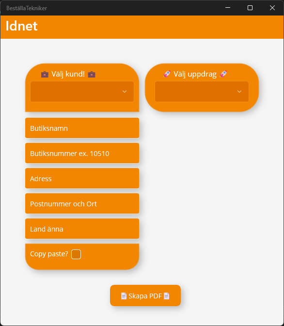

# QuickOrder
"Streamline your service requests with QuickOrder, the app that simplifies creating and sending orders to technicians."

<picture></picture>

The purpose of this project is to enhance the efficiency of order creation in our business environment.  
QuickOrder allows users to quickly create an order and send it via email to subcontractors.  
Users can seamlessly browse through customers and select the required tasks.  
Once the necessary information is filled in, the app generates a PDF.  
Adding new customers is also easy, with support for importing from .json files.  
PDF manipulation is handled via iText, providing smooth document generation.  

## Why?
Our business studio is running very slowly, and orders must be manually deleted from the system afterward.

## Goals?
1. **Refactoring :)**  
2. Integrate the app with our business studio database to retrieve customer and store information.
(Currently, the app uses .json for customer data)
3. Effortlessly add new customers directly through the app.
